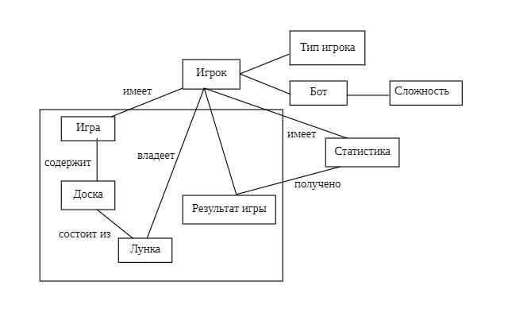

# Анализ предметной области

## Обзор

В данном разделе представлен анализ предметной области игры «Калах». Рассмотрены ключевые сущности, бизнес-правила и проведён сравнительный анализ существующих аналогов.

---

## Содержание раздела

| Файл | Описание |
|------|----------|
| [domain-diagram.jpg](./domain-diagram.jpg) | Диаграмма объектов предметной области (7 сущностей) |
| [business-rules.md](./business-rules.md) | Бизнес-правила игры: регистрация, игровая механика, режимы |
| [competitors-analysis.md](./competitors-analysis.md) | Анализ 3 аналогов с таблицей сравнения |

---

## Ключевые сущности

На основе анализа предметной области выделены следующие сущности:

| Сущность | Описание |
|----------|----------|
| **Игрок** | Пользователь системы (имя, аватар, тип) |
| **Бот** | Разновидность игрока (уровень сложности, глубина поиска) |
| **Игра** | Игровая сессия (тип игры, результат, статус) |
| **Доска** | Игровое поле (набор лунок, оформление) |
| **Лунка** | Элемент доски (тип, количество камней) |
| **Калах** | Накопитель игрока (частный случай лунки) |
| **Статистика** | История игр (победы, поражения) |
| **Результат** | Исход игры (победа игрока 1 / игрока 2 / ничья) |

---

## Диаграмма объектов предметной области

---

## Бизнес-правила

Бизнес-правила определяют ограничения и логику работы системы. Все правила разделены на 3 категории:

1. **Регистрация** — длина имени, выбор аватара
2. **Игровая механика** — количество лунок, камней, правила хода
3. **Режимы и настройки** — режимы игры, уровни сложности, оформление

---

## Анализ аналогов

Проведён анализ трёх существующих приложений:

| Приложение | Разработчик | Ключевые особенности |
|------------|-------------|----------------------|
| **Mancala** | AlignIt Games | 3 режима, яркий интерфейс, звук |
| **Mancala Online – Congklak** | DonkeyCat Games | Онлайн-игра, рейтинги, вертикальная доска |
| **Манкала** | AppOn Innovate | Кастомизация дизайна, 3 режима |

---

## Выводы по анализу

- Существующие аналоги реализуют базовый функционал, но ни один не сочетает:
  - Кастомизацию внешнего вида
  - Возможность изменения параметров доски (лунки, камни)
  - Полноценное звуковое сопровождение

**Разрабатываемая система** объединит эти возможности, добавив гибкие настройки игрового поля.
