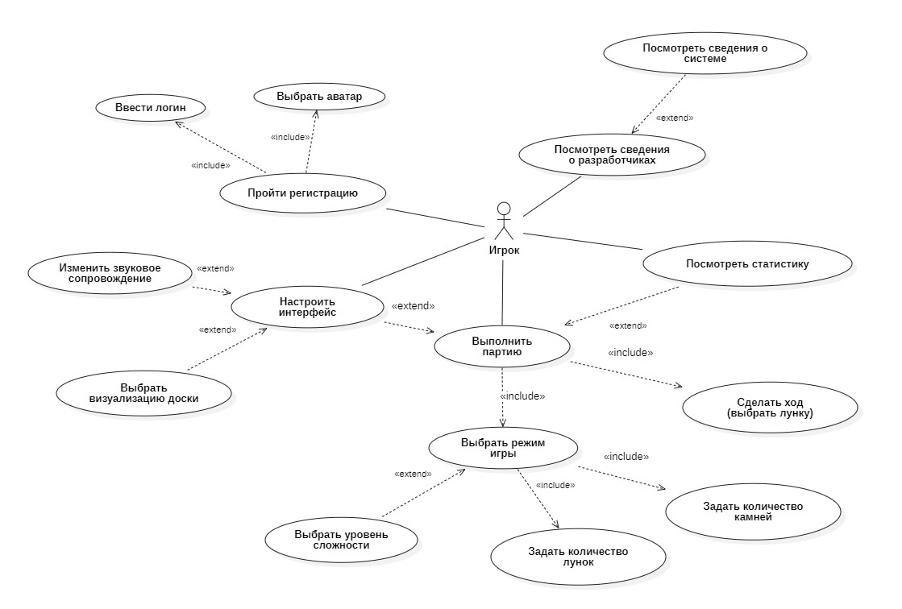

# Диаграмма вариантов использования

## Описание

**Актор:** Игрок.

**Варианты использования:**

| ID | Вариант использования | Описание |
|----|------------------------|-----------|
| UC-01 | Регистрация | Имя 4-8 символов, выбор аватара из 10 |
| UC-02 | Просмотр справочной информации | Правила игры, информация о разработчиках |
| UC-03 | Выполнение партии | Основной игровой процесс |
| UC-04 | Выбор режима игры | PvP (вдвоём) / PvE (с ботом) |
| UC-05 | Настройка доски | Лунки 6-8, камни 4-6 |
| UC-06 | Выбор уровня сложности | 1-3 уровня (только для PvE) |
| UC-07 | Выполнение хода | Посев, захват, дополнительный ход |
| UC-08 | Выбор визуализации доски | 2 темы: «Дерево» / «Металл» |
| UC-09 | Изменение звукового сопровождения | Вкл / Выкл |
| UC-10 | Просмотр статистики | Победы, поражения, история матчей |

## Отношения

- **Включение (include):** «Выполнение партии» (UC-03) включает UC-04, UC-05, UC-07
- **Расширение (extend):** UC-06 расширяет UC-03 (только для режима PvE)

## Диаграмма

